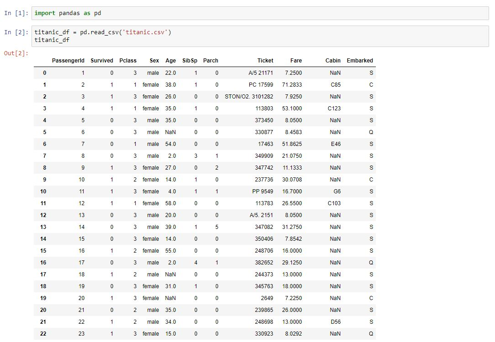
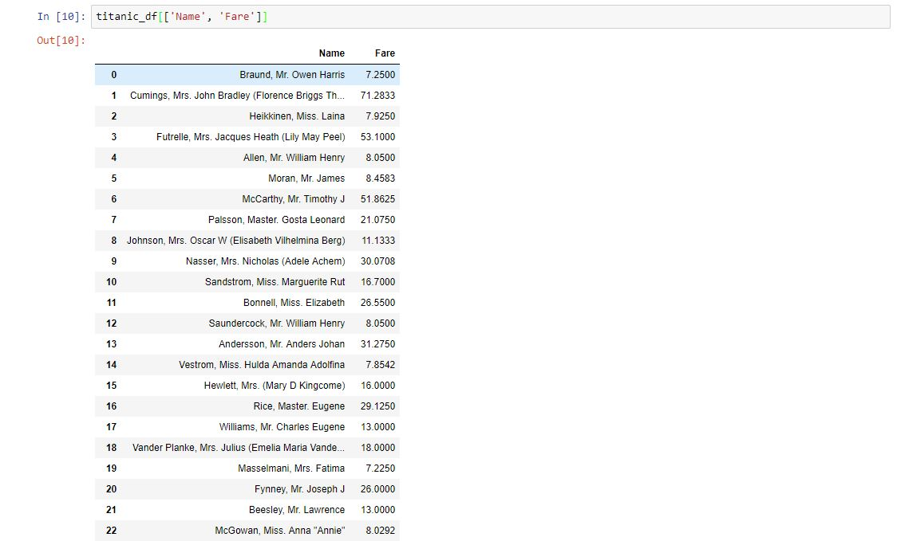
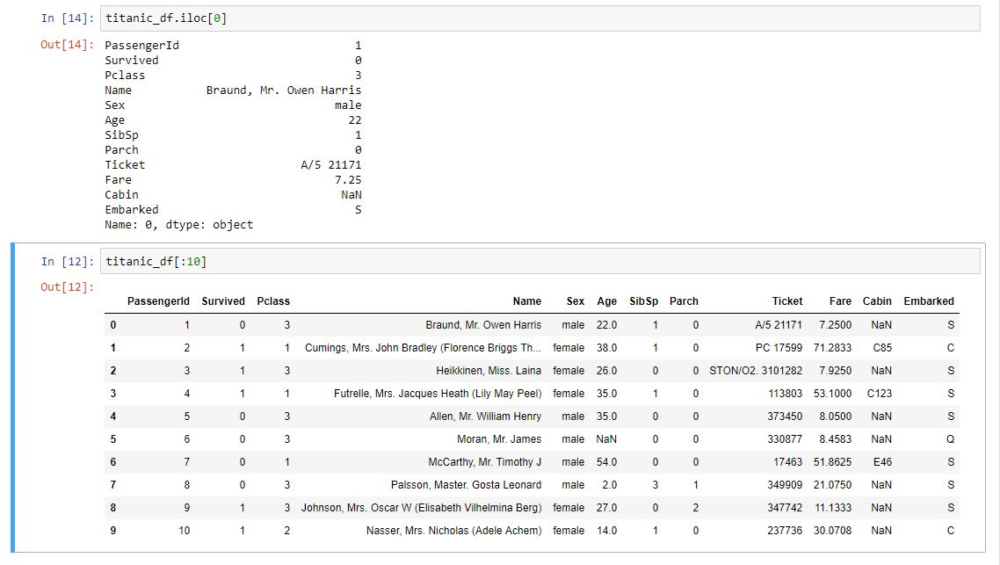
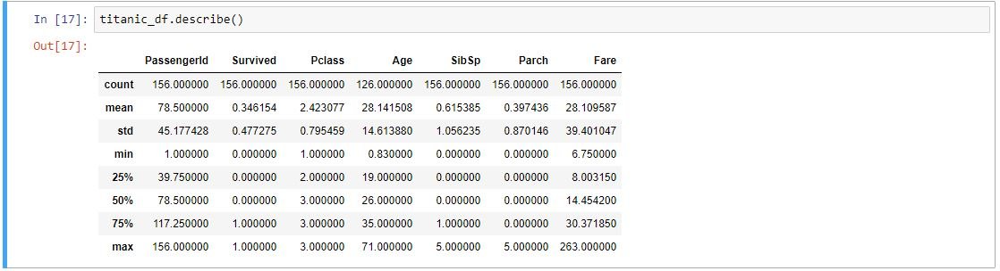
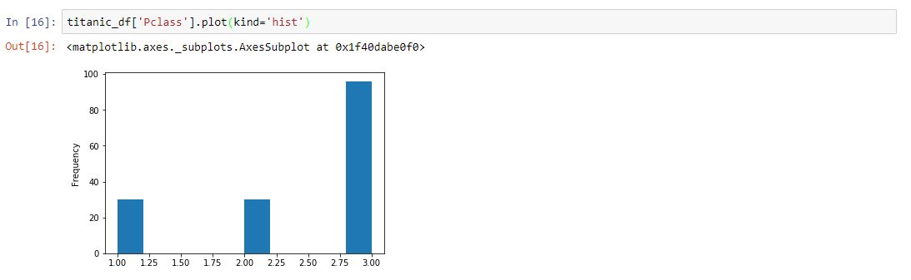

# Why Pandas?

## Getting to know the `Pandas` Library

### Objectives

* Describe the benefits `pandas` provides that basic python or spreadsheets alone cannot.  
* Examine an average case where a data scientist would use `pandas` dataframes.

### What is Pandas?

No matter the industry you work in or the problem you're trying to solve, the first challenge with every new data science project is always the same: getting the data into Python in an organized manner.  [Pandas](https://pandas.pydata.org/) is an open-source library by Wes McKinney that combines the ease of use and organization of a spreadsheet with the power of Python.  

### Storing and Retrieving Data with Pandas

The most important functionality in `pandas` is the `DataFrame` class.  A **_Dataframe_** is a 2-dimensional matrix that makes it super easy to store your data in a clean,ordered way that makes sense.  Dataframes naturally look like a spreadsheet.  One reason data scientists love `pandas` is because of how easy it is to read in data sources and store the information in a dataframe. 

It only takes one line of code!

### Basic overview of Pandas Functionality

Using `pandas` makes it a cinch to access data, by row or by column.  

For instance, if we wanted to just see the names of the passengers and the fare that they paid, we can do that easily in pandas:
    
 

 

If we want to view a specific row or subset of rows, that's easy too!
    
 

Pandas is also much more than a storage tool. Pandas has an incredible amount of statistics, math, and visualization tools built in as well.  

For instance, if we wanted to see the descriptive statistics for every numerical column, there's a method for that:
 
 

 
 
Pandas also contains methods that wrap python's premier visualization library, [matplotlib](https://matplotlib.org/).  For instance, if we wanted to visualize a histogram of ticket classes, that's an easy task in pandas:
 
 

 
 

### Getting Comfortable with Pandas

Throughout this unit, we'll dig deep into all of the awesome functionality contained within pandas, and get you comfortable integrating pandas into your data science workflow.  Before we get into Dataframes, we'll start by learning about a data type that is the main building block of a Dataframe--the pandas `Series` object.   

